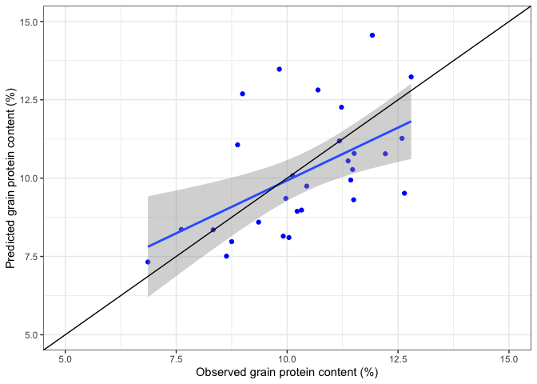

# Setup

```r
# Libraries
library(tidyverse, verbose = F)
library(knitr)
library(readr)
library(dplyr)
library(ggplot2)
```

# Wrangling
Creating a fake data set where `obs` is the observed grain protein content (%) and `pred` is the predicted grain protein content (%).  


```r
set.seed(156)
mydf <- tibble(x=rnorm(30,10,2)) %>%
  mutate(e=rnorm(30,0,2),
         y=0 + 1*x + e) %>%
  select(obs=x, pred=y)

mydf
```

```
## # A tibble: 30 x 2
##      obs  pred
##    <dbl> <dbl>
##  1  7.15  2.83
##  2  7.61  8.36
##  3 10.4   9.75
##  4  9.97  9.35
##  5 12.8  13.2 
##  6  8.63  7.51
##  7 10.2   8.94
##  8  9.91  8.15
##  9 11.9  14.6 
## 10 11.2  11.2 
## # … with 20 more rows
```


```r
ggplot(mydf, aes(x=obs, y=pred))+
         geom_point(color="blue")+
  geom_smooth(method = "lm")+
         geom_abline(intercept = 0, slope = 1)+
         labs(x="Observed grain protein content (%)", y="Predicted grain protein content (%)")+
  theme_bw()+
  scale_y_continuous(limits = c(min=5, max=15))+
  scale_x_continuous(limits = c(min=5, max=15))
```

```
## `geom_smooth()` using formula 'y ~ x'
```

```
## Warning: Removed 1 rows containing non-finite values (stat_smooth).
```

```
## Warning: Removed 1 rows containing missing values (geom_point).
```

<!-- -->


# To-dos  
## To be done  
Next steps in this workflow would be to:
- Create a nice plot (perhaps scatterplot), with 1:1 line, smooth line, and with points colored.

## Done  
- Included the option `keep_md: true` on the 
YAML (this makes sure that the md file is maintained, so the script can be nicely displayed by GitHub)  


